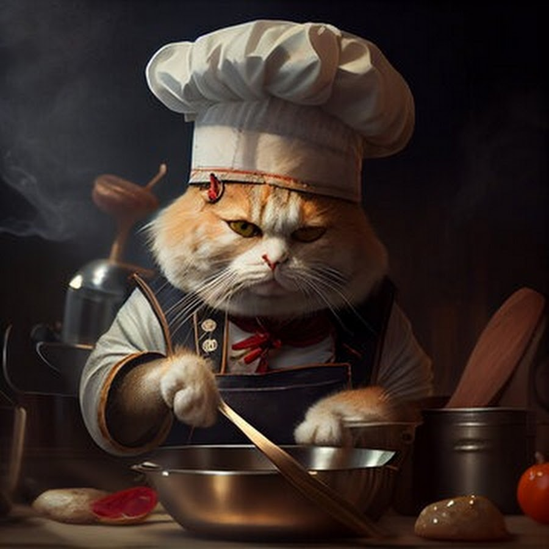

# Mirage Grenade Lineups

## T-side

### Smokes

#### 1. Mid Window - Instant Spawn Smokes
Importance: Throwing mid smokes as fast as possible denies as much information to the CT's and helps you gain mid control.

There are 17 Mirage spawns. You can throw instant mid smokes from 12 of these spawns.

You can check these two videos for the lineups:

Video by _NartOutHere_:

    

Video by CS2 Kitchen: 

    

