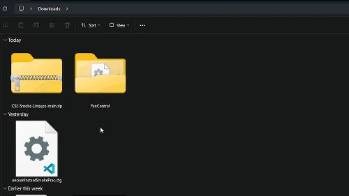

# Counter-Strike 2: Custom Grenade Practice Server Files
This repository contains CFG files for practicing crucial grenade lineups on Counter-Strike 2's active duty maps.

  

# How to Install Custom Practice Maps:
1. Download the required files. You can either:
   - Download the entire repository as a zip file.
   - Download the desired CFG files.

  

    
  

2. Extract the ZIP file.

  

    
  

3. Open your local Counter-Strike 2 files by:
    1. Right clicking CS2 in your steam library.
    2. Selecting "Properties".
    3. Selecting "Installed files".
    4. Pressing "Browse".

  

    
  

4. Navigate to your game's local CFG folder by:
    1. Clicking on the "game" folder.
    2. Clicking on the "csgo" folder. 
    3. Clicking on the "cfg" folder. 

  

    
  

5. Copy or move the desired config file into your CFG folder

  

    
  

5. Launch CS2 on Steam.

  

    
  

6. Launch a practice server on the map you want to practice on. 

  

    
  

7. Open up the developer console and type "exec _cfg-filename_" into the console.
  

    
  

8. Happy practicing!
  

    
  

Feel free to contribute if there are any other maps or lineups you want to add. 

GLHF :) 
